# AWS URL Shortener

The application takes a long URL, generates a short link, and uses the short link to redirect to the original URL.

---

## 1. Setting Up the S3 Buckets

I created two S3 buckets for the project:

* One bucket for storing the URL mappings
* One bucket for hosting the frontend

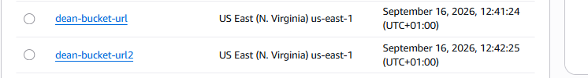

---

## 2. Enabling Website Hosting

I enabled **Static Website Hosting** on the S3 buckets and configured the required index and error documents.

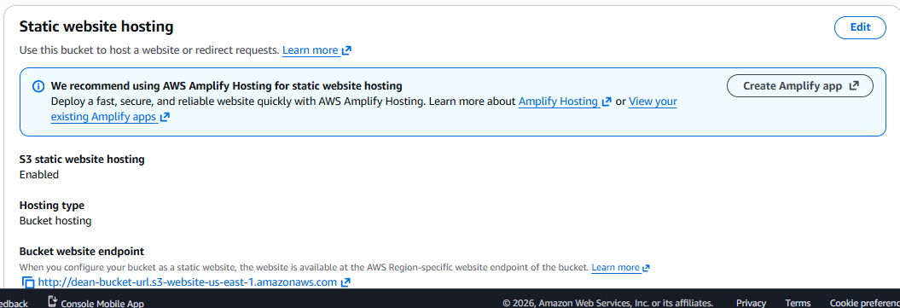

---

## 3. Creating the Lambda Function

I created a Lambda function to handle the URL-shortening process.

I used **Python** as the runtime and configured the required environment variables for the S3 bucket and base URL.

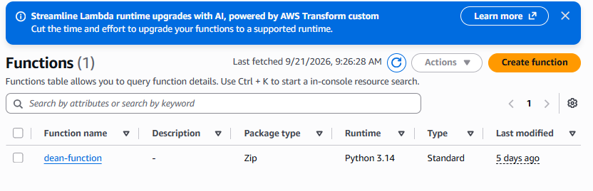

---

## 4. Adding the Lambda Code

I added the backend code to the Lambda function and deployed it.

The function handles the requests and stores the URL information in S3.

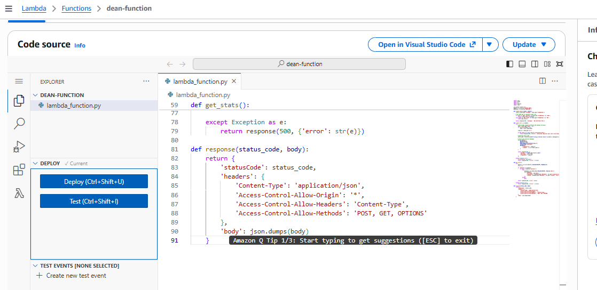

---

## 5. Configuring IAM Permissions

I configured the Lambda execution role with the required S3 permissions so the function could interact with the buckets.

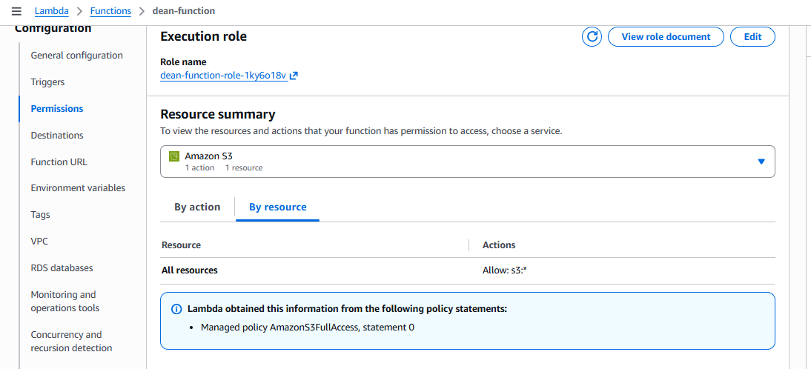

---

## 6. Setting Up API Gateway

I created an **HTTP API** in API Gateway and connected it to the Lambda function.

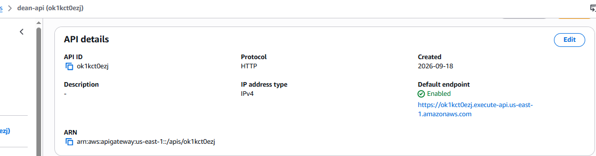

---

## 7. Creating the API Routes

I added the required routes for the application, including the route used to create shortened URLs.

I also configured CORS so the frontend could communicate with the API.

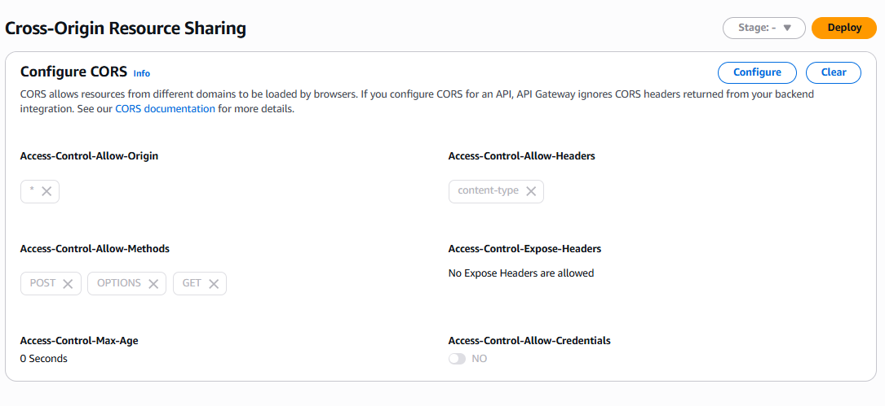
---

## 8. Uploading the Frontend

I uploaded the frontend files to the frontend S3 bucket and configured the bucket for public access.

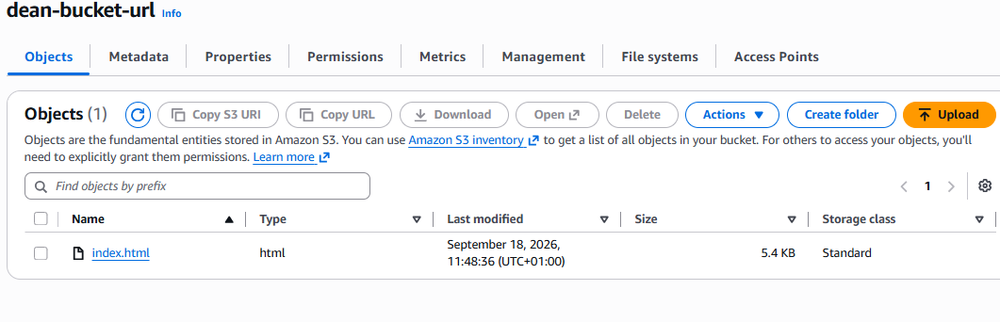

---

## 9. Configuring the Bucket Policies

I added the necessary S3 bucket policies to allow the frontend and shortened URLs to be accessed correctly.

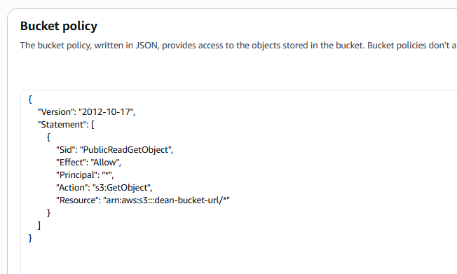

---

## 10. Testing the Application

I opened the S3 website URL and entered a long URL into the application.

After clicking the shorten button, the application generated a short URL.

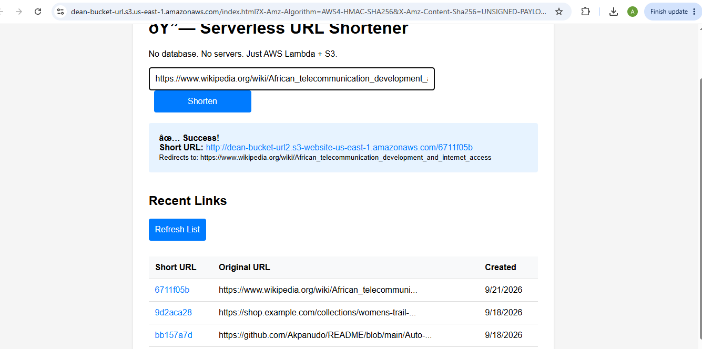

---

## 11. Testing the Short Link

I opened the generated short URL to confirm that it redirected to the original website successfully.

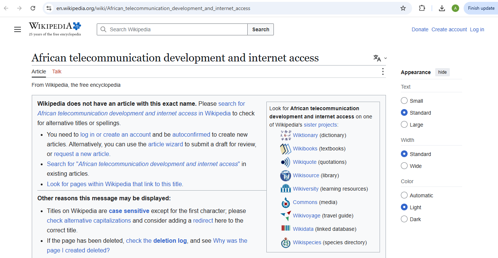